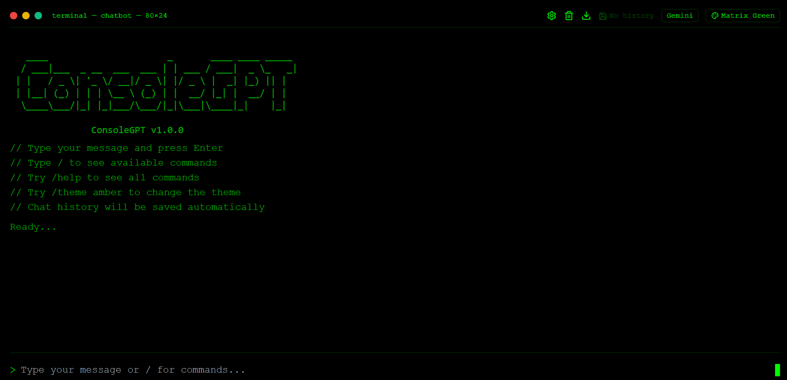
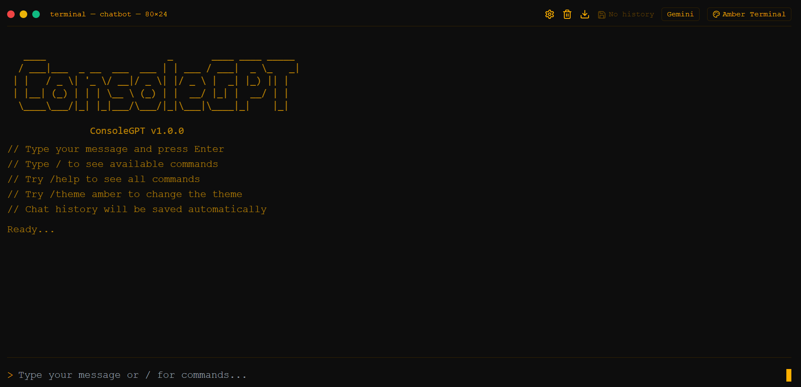
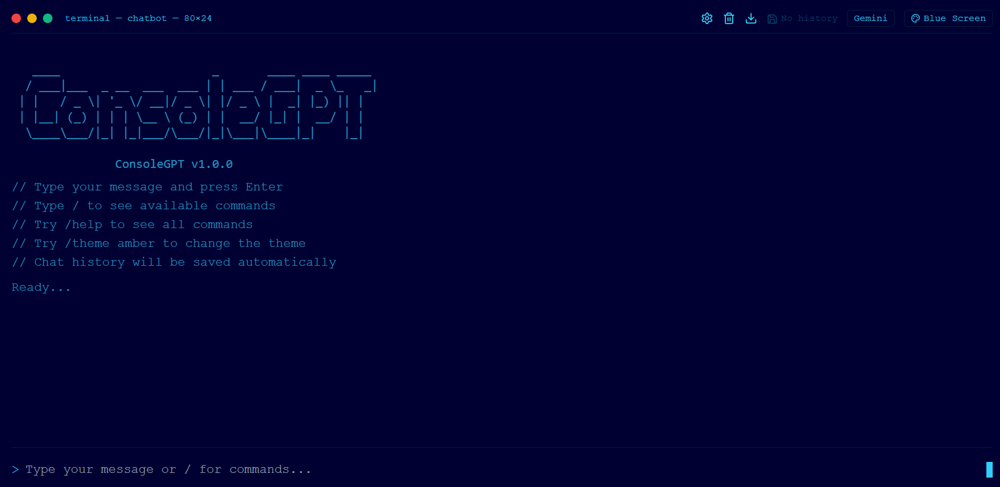
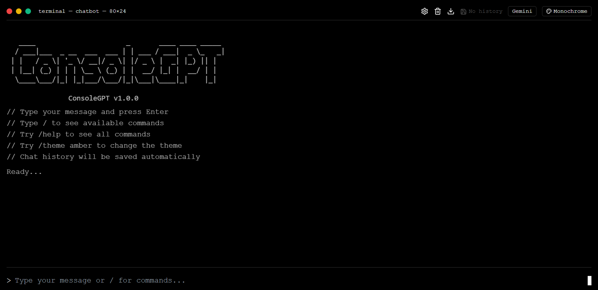
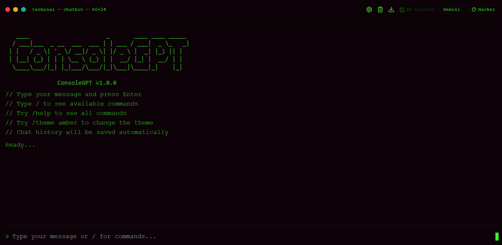

#   ConsoleGPT

A console-based ChatGPT clone with a nostalgic terminal interface — fast, minimalist, and privacy-first. Supports OpenAI and Gemini with custom prompts, themes, and local history.



## ✨ Features

- 🖥️ **Terminal UI** — Green-on-black ASCII-styled interface
- 💬 **Chat with AI** — Works with OpenAI and Gemini API keys
- 🧠 **Custom System Prompt** — Define how the AI behaves
- 🎨 **Retro Themes** — Matrix Green, Amber, Blue Screen, Monochrome, Hacker
- 📜 **Local History** — Conversations saved in browser's localStorage
- 🔒 **Privacy-First** — No account, no cloud, no tracking
- ⌨️ **Keyboard-Friendly** — Type fast, live like a hacker
- 🧩 **Slash Commands** — `/help`, `/clear`, `/theme`, `/reset`, and more


## 🛠️ Installation

You can clone and run ConsoleGPT locally:

```bash
git clone https://github.com/malharchauhan7/console-gpt-v1.git
cd console-gpt
npm install --force
npm run dev
```

Open http://localhost:3000 in your browser.

## 🔐 API Key Setup
To use ConsoleGPT, you need an API key from one of the following providers:

OpenAI → https://platform.openai.com/account/api-keys

Gemini (Google AI) → https://makersuite.google.com/app/apikey

Your API key is stored only in localStorage and never sent to any server. You’re fully in control.

## 💬 Usage Guide
Here are some basic instructions:
```bash
// Type your message and press Enter
// Type /help to see available commands
// Try /theme amber to change the terminal theme
// Set your own system prompt for better roleplay or custom AI behavior
```

## 🧩 Slash Commands

| Command         | Description                                 |
|-----------------|---------------------------------------------|
| `/help`         | Show all available commands                 |
| `/theme <name>` | Change the theme (e.g., `matrix`, `amber`) |
| `/clear`        | Clear the current chat session              |
| `/reset`        | Reset API key, prompt, and history          |
| `/prompt`       | Change the system prompt                    |

---

## 🎨 Available Themes

- `matrix` – Green on black (classic hacker)
- `amber` – Amber CRT feel
- `blue` – Blue screen nostalgia
- `monochrome` – Minimal black & white
- `hacker` – Sharp modern hacker contrast

Use `/theme <name>` to activate.


## 📸 Screenshots


### Settings


### Matrix Green


### Amber Terminal


### Blue Screen


### Monochrome


### Hacker



## 🤝 Contributing
Contributions are welcome! Open issues, suggest features, or submit pull requests to improve the project.

## 📄 License
This project is licensed under the MIT License.

## 🙏 Acknowledgements
Built with ❤️ by Malhar

Inspired by ChatGPT, vintage terminals, and command-line nerds everywhere

Powered by OpenAI and Gemini APIs